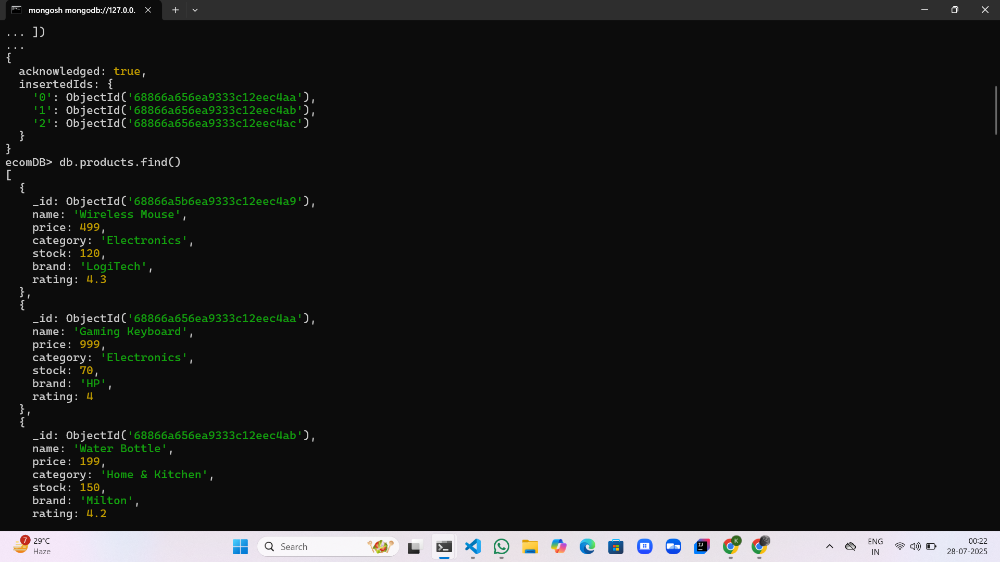
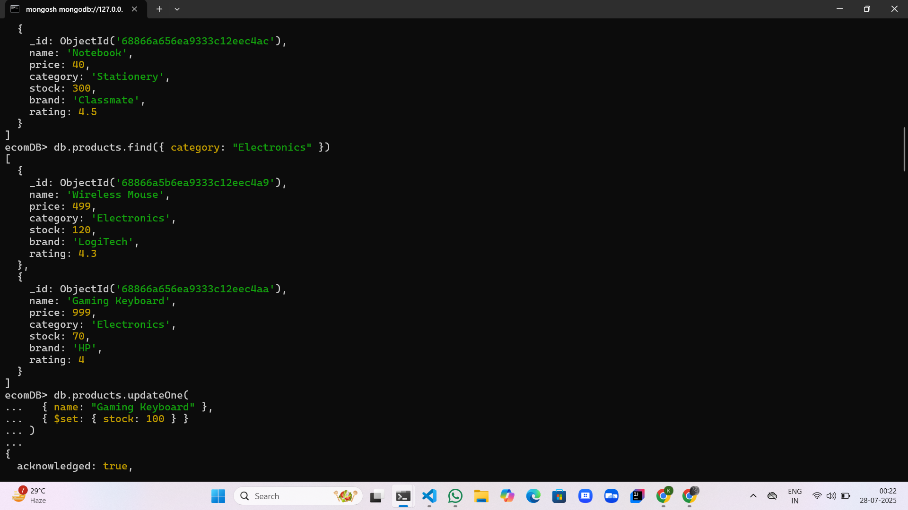
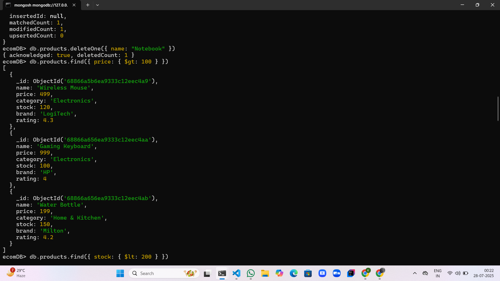
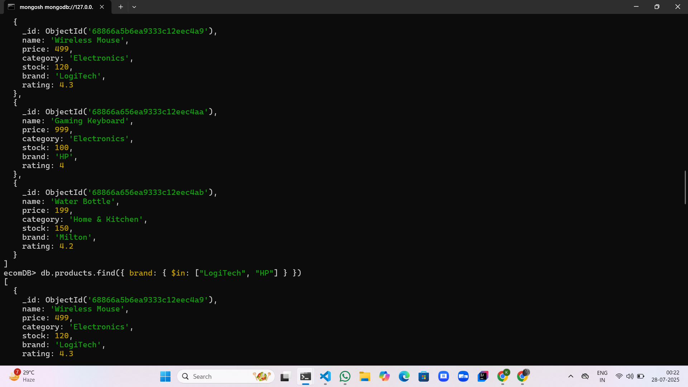
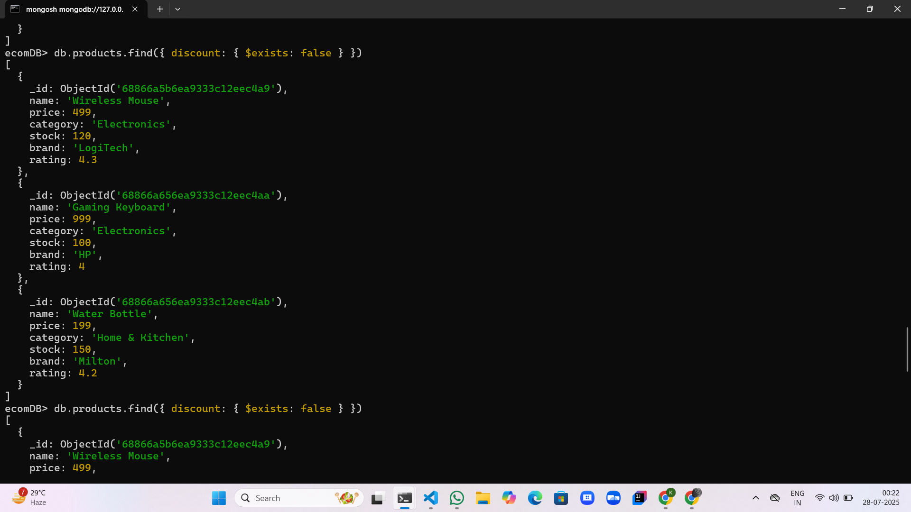
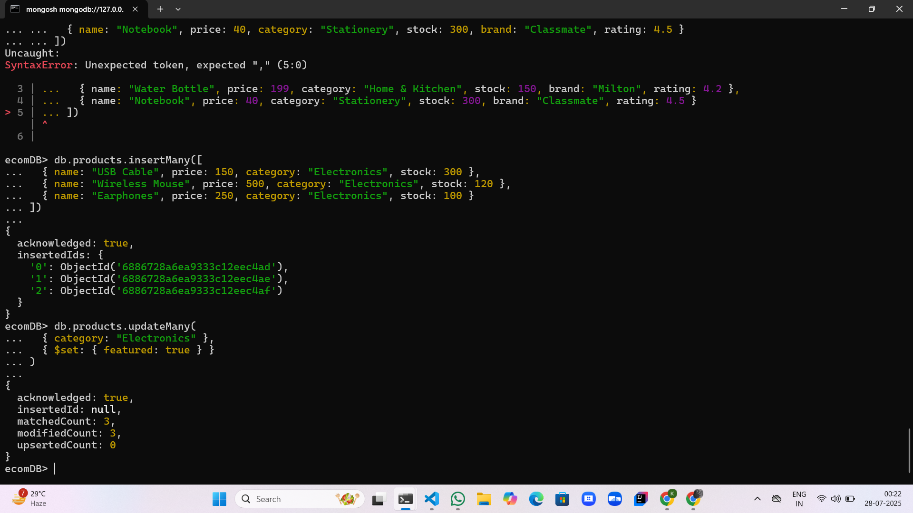
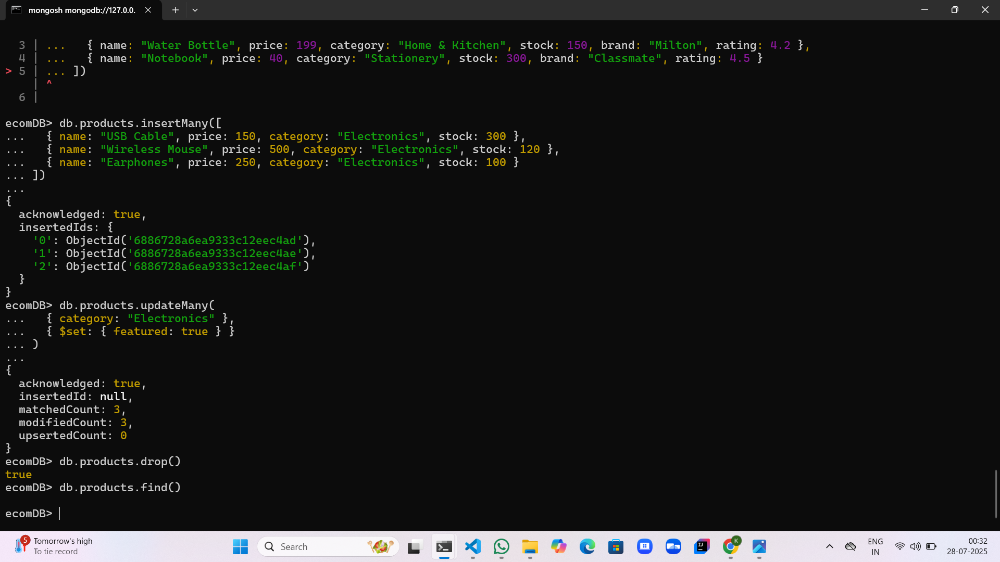

# MongoDB Practice Task

This project contains basic MongoDB commands and operations used for practicing core database concepts like:

- Creating and switching databases
- Creating collections
- Inserting documents
- Updating data
- Deleting documents
- Viewing data

All commands were executed using the MongoDB shell (`mongosh`) with a local MongoDB setup.

## 🗂️ Database Used

- **Database Name**: `ecomDB`
- **Collection Name**: `products`

## 🧪 Basic Commands Practiced

- `use ecomDB` – Create or switch to a database  
- `db.createCollection("products")` – Create a collection  
- `db.products.insertOne(...)` – Insert one document  
- `db.products.insertMany(...)` – Insert multiple documents  
- `db.products.find()` – View all documents  
- `db.products.updateOne(...)` – Update a specific document  
- `db.products.updateMany(...)` – Update multiple documents  
- `db.products.deleteOne(...)` – Delete one document  
- `db.products.deleteMany(...)` – Delete multiple documents  
- `db.products.drop()` – Drop the entire collection  

## 📸 Screenshots

### 🟢 Starting mongosh shell

### 📂 Using `ecomDB` database

### 📁 Creating `products` collection

### 📝 Inserting documents

### 🔍 Finding documents

### ✏️ Updating data

### 🗑️ Deleting data

### 🚮 Dropping collection

### ✅ Final check

## 📁 File Included

- `MongoDB_Practice_Task.txt` – Contains all commands used with simple explanations.

## ✅ Status

✔️ Completed basic MongoDB operations for practice.
